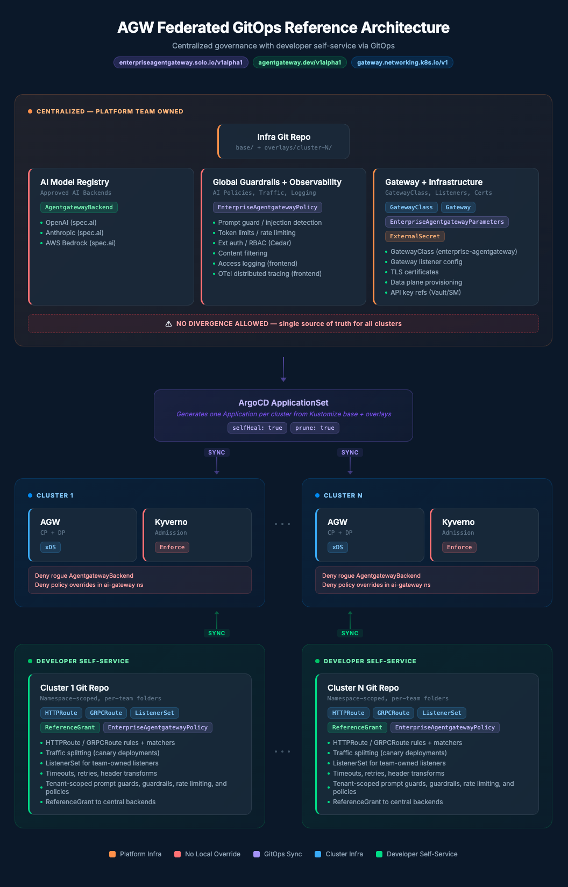

# AI Gateway — Federated GitOps Reference Architecture



> **Product**: Solo Enterprise for Agentgateway
> **API Groups**: `enterpriseagentgateway.solo.io/v1alpha1` (enterprise policies/parameters), `agentgateway.dev/v1alpha1` (backends, OSS policies)

## Overview

This document describes a GitOps-based approach to federating Solo Enterprise for Agentgateway configuration across multiple Kubernetes clusters while maintaining centralized control over AI policies, guardrails, and model registries.

### Problem

AGW's controller is designed as a per-cluster control plane that watches local CRDs and emits xDS to the co-located data plane. Organizations running AGW across multiple clusters need centralized governance over:

- **AI Policies** — prompt guards, content filtering, token limits
- **Guardrails** — safety controls that must be uniform across all clusters
- **Model Registry** — which AI backends and models are approved for use

These cannot diverge across clusters without defeating the objective of having a single source of truth for AI workloads.

### Approach

Rather than implementing a custom hub-and-spoke control plane, we use **GitOps** (ArgoCD + Kustomize) as the federation mechanism. Git is the single source of truth, and ArgoCD ApplicationSets propagate centralized configuration to all clusters. Each cluster retains its own AGW control plane + data plane — GitOps ensures config consistency without requiring a custom federation layer.

---

## Architecture Principles

| # | Principle | Rationale |
|---|-----------|-----------|
| 1 | Single source of truth | AI policies, guardrails, and registries live in one infra git repo |
| 2 | No custom control plane | ArgoCD ApplicationSets handle hub-to-leaf propagation |
| 3 | Developer self-service | Teams manage their own routes via per-cluster repos within guardrails |
| 4 | Runtime enforcement | Kyverno admission policies prevent local overrides of centralized resources |
| 5 | AGW colocation preserved | Each cluster runs its own AGW CP+DP — the architecture does not change AGW's deployment model |

---

## Repository Topology

```
┌─────────────────────────────────────────────────────────────┐
│                     Infra Git Repo                          │
│              (Platform Team — all clusters)                  │
│                                                             │
│  base/                       overlays/                      │
│  ├── gatewayclass.yaml       ├── cluster-1/kustomization    │
│  ├── gateway.yaml            ├── cluster-2/kustomization    │
│  ├── backends/               └── cluster-N/kustomization    │
│  ├── global-policies/                                       │
│  ├── observability/                                         │
│  ├── admission-policies/                                    │
│  ├── rbac/                                                  │
│  └── secrets/                                               │
└──────────────────────┬──────────────────────────────────────┘
                       │ ArgoCD ApplicationSet
                       │ (one App per cluster)
            ┌──────────┼──────────┐
            ▼          ▼          ▼
       cluster-1   cluster-2   cluster-N
            ▲          ▲          ▲
            │          │          │
┌───────────┘  ┌───────┘  ┌──────┘
│              │           │
│  Cluster 1   │ Cluster 2 │ Cluster N
│  Git Repo    │ Git Repo  │ Git Repo
│  (Dev self-  │           │
│   service)   │           │
└──────────────┘           │
                           └──────────────
```

### Infra Git Repo (Centralized)

Owned by the platform team. Contains all resources that must not diverge across clusters.

```
infra-repo/
├── base/                                # Shared across ALL clusters
│   ├── kustomization.yaml
│   ├── namespace.yaml                   # ai-gateway namespace
│   ├── gatewayclass.yaml                # GatewayClass (enterprise-agentgateway)
│   ├── gateway.yaml                     # Gateway listener config
│   ├── backends/
│   │   ├── kustomization.yaml
│   │   ├── openai.yaml                  # AgentgatewayBackend (spec.ai)
│   │   ├── anthropic.yaml               # AgentgatewayBackend (spec.ai)
│   │   └── bedrock.yaml                 # AgentgatewayBackend (spec.ai)
│   ├── global-policies/
│   │   ├── kustomization.yaml
│   │   ├── prompt-guard.yaml            # Prompt injection detection
│   │   ├── token-limits.yaml            # Global token budget limits
│   │   └── content-filter.yaml          # Content safety filtering
│   ├── observability/
│   │   ├── kustomization.yaml
│   │   ├── access-logging.yaml          # EnterpriseAgentgatewayPolicy frontend access logs
│   │   └── tracing.yaml                 # EnterpriseAgentgatewayPolicy frontend OTel tracing
│   ├── admission-policies/
│   │   ├── kustomization.yaml
│   │   ├── deny-local-backends.yaml     # Kyverno: block local backend creation
│   │   ├── deny-policy-override.yaml    # Kyverno: block local guardrail changes
│   │   └── require-guardrail-ref.yaml   # Kyverno: HTTPRoutes must ref global guardrails
│   ├── rbac/
│   │   ├── kustomization.yaml
│   │   ├── platform-admin-role.yaml
│   │   └── developer-role.yaml          # Scoped: HTTPRoute, GRPCRoute, ListenerSet, ReferenceGrant
│   └── secrets/
│       ├── kustomization.yaml
│       └── external-secrets.yaml        # ExternalSecret CRDs → Vault / AWS SM
├── overlays/
│   ├── cluster-1/
│   │   ├── kustomization.yaml           # Patches: region endpoints, secret store refs
│   │   └── patches/
│   │       └── backend-endpoints.yaml
│   ├── cluster-2/
│   │   ├── kustomization.yaml
│   │   └── patches/
│   │       └── backend-endpoints.yaml
│   └── cluster-N/
│       └── ...
└── argocd/
    └── applicationset.yaml              # Generates per-cluster ArgoCD Applications
```

### Cluster Git Repos (Per-Cluster, Developer Self-Service)

One repo per cluster. Developers manage their own routes within namespace boundaries.

```
cluster-1-repo/
├── team-a/
│   ├── kustomization.yaml
│   ├── namespace.yaml
│   ├── httproute-chat.yaml              # HTTPRoute with AI matchers
│   ├── httproute-embeddings.yaml
│   ├── grpcroute-inference.yaml         # GRPCRoute for gRPC AI services
│   ├── listenerset.yaml                 # ListenerSet for team-owned listeners
│   ├── reference-grant.yaml             # Allow referencing central backends
│   └── ent-agw-policy.yaml              # Team-level timeouts, retries, header transforms
├── team-b/
│   ├── kustomization.yaml
│   ├── namespace.yaml
│   ├── httproute-completion.yaml
│   ├── grpcroute-agents.yaml            # GRPCRoute for A2A agent traffic
│   └── reference-grant.yaml
└── argocd/
    └── appproject.yaml                  # ArgoCD AppProject with namespace restrictions
```

---

## Resource Ownership Matrix

| Resource | Owner | Repo | Scope | Can Devs Create? |
|----------|-------|------|-------|------------------|
| `GatewayClass` | Platform | Infra | Cluster | No (RBAC) |
| `Gateway` | Platform | Infra | Cluster | No |
| `AgentgatewayBackend` | Platform | Infra | Namespace | No (Kyverno) |
| `EnterpriseAgentgatewayPolicy` (global guardrails) | Platform | Infra | Namespace | No (Kyverno) |
| `EnterpriseAgentgatewayPolicy` (observability) | Platform | Infra | Namespace | No (Kyverno) |
| `EnterpriseAgentgatewayParameters` | Platform | Infra | Namespace | No (RBAC) |
| `ClusterPolicy` (Kyverno) | Platform | Infra | Cluster | No (RBAC) |
| `ExternalSecret` | Platform | Infra | Namespace | No (RBAC) |
| `HTTPRoute` | Developer | Cluster | Namespace | **Yes** |
| `GRPCRoute` | Developer | Cluster | Namespace | **Yes** |
| `ListenerSet` | Developer | Cluster | Namespace | **Yes** |
| `ReferenceGrant` | Developer | Cluster | Namespace | **Yes** |
| `EnterpriseAgentgatewayPolicy` (namespace-scoped) | Developer | Cluster | Namespace | **Yes** (timeouts, retries, headers, tenant-scoped guardrails and policies) |

---

## GitOps Implementation

### ArgoCD ApplicationSet

The infra repo uses an ApplicationSet with a list generator to create one ArgoCD Application per cluster:

```yaml
apiVersion: argoproj.io/v1alpha1
kind: ApplicationSet
metadata:
  name: agw-infra
  namespace: argocd
spec:
  generators:
    - list:
        elements:
          - cluster: cluster-1
            url: https://cluster-1.example.com
            region: us-east-1
          - cluster: cluster-2
            url: https://cluster-2.example.com
            region: eu-west-1
          # Add new clusters here
  template:
    metadata:
      name: 'agw-infra-{{cluster}}'
    spec:
      project: platform
      source:
        repoURL: https://github.com/org/agw-infra.git
        targetRevision: main
        path: 'overlays/{{cluster}}'
      destination:
        server: '{{url}}'
        namespace: ai-gateway
      syncPolicy:
        automated:
          prune: true
          selfHeal: true        # Revert manual kubectl changes
        syncOptions:
          - CreateNamespace=true
```

Key settings:
- **`selfHeal: true`** — reverts any manual `kubectl apply` that creates drift
- **`prune: true`** — removes resources that were deleted from git
- Per-cluster overlays allow region-specific patches while sharing the base

### Kustomize Overlay Example

```yaml
# overlays/cluster-1/kustomization.yaml
apiVersion: kustomize.config.k8s.io/v1beta1
kind: Kustomization
resources:
  - ../../base
patches:
  - path: patches/backend-endpoints.yaml
```

```yaml
# overlays/cluster-1/patches/backend-endpoints.yaml
apiVersion: agentgateway.dev/v1alpha1
kind: AgentgatewayBackend
metadata:
  name: openai
spec:
  ai:
    provider:
      openai:
        authToken:
          secretRef:
            name: openai-api-key-cluster-1  # Cluster-specific secret reference
```

The **base** is identical everywhere (single source of truth). Overlays only patch what must differ: region-specific endpoints, secret store references, resource limits.

---

## Enforcement Layer

### Why GitOps Alone Is Not Enough

GitOps ensures **eventual consistency** — if someone deletes a resource, ArgoCD recreates it. But GitOps alone does NOT prevent someone from **creating additional resources** that bypass centralized policies:

- A developer could `kubectl apply` a rogue `AgentgatewayBackend` pointing to an unapproved model
- A developer could create a guardrail policy that weakens protections
- ArgoCD won't prune resources it doesn't manage

**Admission policies close this gap.** They enforce at request-time, before the resource is persisted to etcd.

### Kyverno Policy: Deny Local Backend Creation

```yaml
apiVersion: kyverno.io/v1
kind: ClusterPolicy
metadata:
  name: deny-local-agentgateway-backends
  annotations:
    policies.kyverno.io/description: >-
      Only the platform team (via GitOps) can create backend resources.
      Ensures a single source of truth for the AI model registry.
spec:
  validationFailureAction: Enforce
  background: false
  rules:
    - name: deny-manual-backend-creation
      match:
        any:
          - resources:
              kinds:
                - AgentgatewayBackend              # agentgateway.dev/v1alpha1
      exclude:
        any:
          - subjects:
              - kind: ServiceAccount
                name: argocd-application-controller
                namespace: argocd
      validate:
        message: >-
          Backend resources can only be managed via the infra git repo.
          Contact the platform team to add a new AI backend.
        deny: {}
```

### Kyverno Policy: Deny Local Policy Override

```yaml
apiVersion: kyverno.io/v1
kind: ClusterPolicy
metadata:
  name: deny-agentgateway-policy-override
spec:
  validationFailureAction: Enforce
  background: false
  rules:
    - name: deny-local-policy-in-platform-ns
      match:
        any:
          - resources:
              kinds:
                - EnterpriseAgentgatewayPolicy     # enterpriseagentgateway.solo.io/v1alpha1
              namespaces:
                - ai-gateway           # Platform namespace — devs cannot create policies here
      exclude:
        any:
          - subjects:
              - kind: ServiceAccount
                name: argocd-application-controller
                namespace: argocd
      validate:
        message: >-
          Policy resources in the ai-gateway namespace can only be
          managed via the infra git repo.
        deny: {}
```

### Kyverno Policy: Require Guardrail Reference on HTTPRoutes

```yaml
apiVersion: kyverno.io/v1
kind: ClusterPolicy
metadata:
  name: require-guardrail-reference
spec:
  validationFailureAction: Enforce
  rules:
    - name: httproute-must-reference-guardrails
      match:
        any:
          - resources:
              kinds:
                - HTTPRoute
      validate:
        message: >-
          All AI HTTPRoutes must reference a global guardrail policy.
          Ensure a matching EnterpriseAgentgatewayPolicy with guardrail
          configuration targets this route.
        deny: {}
```

> **Note:** AGW enforces guardrails via `EnterpriseAgentgatewayPolicy` resources that target routes using `targetRefs` or `targetSelectors`. The Kyverno pattern above can be refined to validate that a corresponding policy exists for the route's namespace.

---

## Secret Management

LLM API keys must never be stored in git. Use ExternalSecrets Operator with a central secret store:

```yaml
# base/secrets/external-secrets.yaml
apiVersion: external-secrets.io/v1beta1
kind: ExternalSecret
metadata:
  name: openai-api-key
  namespace: ai-gateway
spec:
  refreshInterval: 1h
  secretStoreRef:
    name: vault-backend            # Cluster-specific via overlay patch
    kind: ClusterSecretStore
  target:
    name: openai-api-key
  data:
    - secretKey: api-key
      remoteRef:
        key: ai-gateway/openai
        property: api-key
```

Each cluster overlay patches `secretStoreRef` to point to the appropriate vault instance for that environment. The actual keys live in Vault / AWS Secrets Manager / GCP Secret Manager — never in git.

---

## Developer Self-Service Workflow

### What Developers Can Do

Developers manage application-level traffic within their namespace:

- **Routing**: `HTTPRoute` and `GRPCRoute` for hostname, path, header-based matching
- **Listeners**: `ListenerSet` for team-owned listeners on the shared Gateway
- **Traffic splitting**: Weight-based splits in route rules (e.g., canary deployments)
- **Application policies**: Namespace-scoped `EnterpriseAgentgatewayPolicy` for timeouts, retries, and header transformations
- **Tenant-specific guardrails**: Tenant-scoped prompt guards, guardrails, rate limiting, and policies
- **Backend binding**: Attach routes to centrally-managed backends via `parentRefs` + `ReferenceGrant`

### Adding a New AI Route

1. Developer creates a branch in their cluster repo
2. Adds an `HTTPRoute` or `GRPCRoute` in their team folder:

```yaml
apiVersion: gateway.networking.k8s.io/v1
kind: HTTPRoute
metadata:
  name: my-app-chat
  namespace: team-a
spec:
  parentRefs:
    - name: ai-gateway
      namespace: ai-gateway
  rules:
    - matches:
        - path:
            value: /api/chat
      backendRefs:
        - group: agentgateway.dev
          kind: AgentgatewayBackend
          name: openai
          namespace: ai-gateway
```

3. Adds a `ReferenceGrant` to allow cross-namespace backend reference
4. Opens a PR — reviewed by team lead
5. On merge, ArgoCD syncs the route to the cluster

### What Developers Cannot Do

| Action | Blocked By |
|--------|-----------|
| Create/modify `AgentgatewayBackend` | Kyverno ClusterPolicy |
| Create cluster-scoped AI policies | Kyverno ClusterPolicy |
| Override global guardrail policies | Kyverno ClusterPolicy |
| Deploy routes without guardrail reference | Kyverno ClusterPolicy |
| Modify RBAC or admission policies | Kubernetes RBAC |
| Access secrets in `ai-gateway` namespace | Kubernetes RBAC |

---

## Day-2 Operations

### Adding a New Cluster

1. Add cluster credentials to ArgoCD
2. Create `overlays/cluster-N/` in the infra repo with required patches
3. Add the cluster entry to the ApplicationSet generator list
4. Create a new cluster git repo from the template
5. ArgoCD automatically provisions all centralized resources + admission policies

### Adding a New AI Backend

1. Platform team adds `AgentgatewayBackend` + `EnterpriseAgentgatewayPolicy` to `base/backends/` and `base/global-policies/`
2. Add API key to the central secret store (Vault / AWS SM)
3. Add `ExternalSecret` reference to `base/secrets/`
4. Merge to main — ArgoCD propagates to **all clusters** automatically
5. Developers can now reference the new backend in their HTTPRoutes

### Updating Global Policies

1. Platform team modifies policy in `base/global-policies/`
2. PR review + approval
3. Merge to main — ArgoCD applies to all clusters within sync interval (~3 min default)
4. `selfHeal: true` ensures any manual overrides are reverted

### Emergency Break-Glass

For urgent situations where the GitOps cycle is too slow:

1. Authorized platform admin can `kubectl apply` directly (Kyverno exclusion can be extended to a break-glass ServiceAccount)
2. Corresponding git change **must** follow within the agreed SLA (e.g., 1 hour)
3. ArgoCD will reconcile on next sync — if the git change is missing, `selfHeal` reverts the manual change
4. Break-glass usage should be audited and alerted on

---

## Summary

| Concern | Mechanism |
|---------|-----------|
| Single source of truth | Infra git repo `base/` directory |
| Hub-to-leaf propagation | ArgoCD ApplicationSet + Kustomize overlays |
| Cluster-specific customization | Kustomize overlays (endpoints, secret refs only) |
| Runtime enforcement | Kyverno ClusterPolicies (deny local `AgentgatewayBackend`, protect global `EnterpriseAgentgatewayPolicy`) |
| Drift prevention | ArgoCD `selfHeal: true` + `prune: true` |
| Secret management | ExternalSecrets Operator → Vault / cloud secret store |
| Developer self-service | Per-cluster repos, namespace-scoped: HTTPRoute, GRPCRoute, ListenerSet, ReferenceGrant |
| Observability | Centralized access logging + OTel tracing via `EnterpriseAgentgatewayPolicy` frontend |
| Scalability | Add overlay + generator entry to onboard a new cluster |
